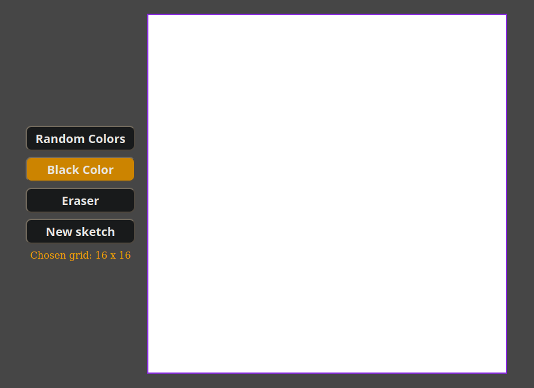

# etch-a-sketch
A browser version of something between a sketchpad and Etch-A-Sketch.

The project is supposed to show my DOM manipulation skills.

This is a project which is part of <a href="https://www.theodinproject.com">The Odin Project</a> curriculum.

Screenshot preview:

Live preview here:
https://andishaa.github.io/etch-a-sketch/